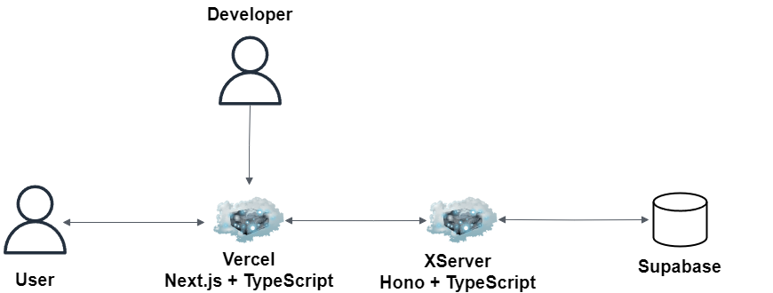

# Hono + TypeScript + SupabaseによるメッセンジャーWeb API

## Tech
---

- Backend
  - Hono
  - TypeScript
- DB + Authentication
  - Supabase
- ORM
  - Prisma ORM
- Cloud Server
  - XServer
- Domain(お名前.com)

- [不採用]
  - Cloud
    - AWS
  - IaC
    - Terraform

# AWS(保留) → XServer

以下をTerraformで構築。ドメインはお名前.comで購入。 
※ スケーリング時にバグ発生。バックエンドAPIを複数に変更するとWebSocketインスタンスの管理にミスが発生した。 
   おそらくAWS ALB スティッキーセッションの設定の変更が必要だった。 
   工数がかかりすぎたので、一旦XServerからサーバーをレンタルし、そこにサーバーを構築。 

- AWS
  - ECS or Fargate
  - ELB(ALB)
  - Route53
  - ACM
  - CloudWatch
  - VPC
    - Public Subnet
    - Private Subnet
    - Route Table
    - IGW
  - Securty Group
  - IAM
  - Secret Manager

## Architecture

## Frontend

以下リポジトリ。

https://github.com/kojikawazu/nextjs-hono-front-messanger-app

# Memo
---

- リアルタイム通信はWebSocketを使用することに決定。
  - WebSocket(採用)
  - Push(不採用)
- AWSを使用。とりあえず、HTTPSでアクセスできるところまで。
- カスタムドメインをお名前.comで購入。

# TODO
---

- まだ移行していない機能は後に移行する。

- CICDはひとまずGitHub Actions。AWS ECRにコンテナイメージをプッシュする予定。

# Execute
---

docker-compose.yml に Honoコンテナを設定して使用すること

# URL
---

- [Bun](https://bun.sh/guides/ecosystem/nextjs)

- [Hono](https://hono.dev/getting-started/basic)

- [Supabase](https://supabase.com)

- [Prisma](https://www.prisma.io)

- [AWS](https://aws.amazon.com/jp/console/)

- [お名前.com](https://cp.onamae.ne.jp/login)

- [XServer](https://www.xserver.ne.jp/)